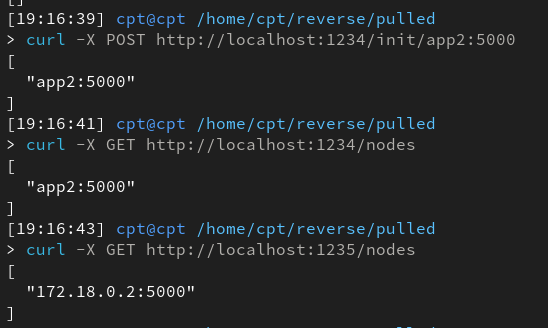

# Potężny blockchain
Propozycja jak to zrobić:
1. Komunikacja jako zwykłe HTTP (szkic endpointów w main.py),
2. Propozycja implementacji bloków i liczenia hashów itd. w block.py (tam też jest przykład użycia na dole).

W zasadzie cała komunikacja to byłoby użycie *requests*, wywoływanie
- requests.get()
- requests.post()

z argumentami odpowiednimi. Jakieś opisy tego co endpointy powinny robić są w kodzie.

Przykład dołączania node'a:

## Komendy do testowania:

Inicjalizacja nodów:
        
    curl -X POST http://localhost:1234/init/app1:5000

Wykopanie bloku:

    curl -X POST http://localhost:1234/mine -H "Content-Type: application/json" -d '{"data": "Tutaj dane dla blocku"}'

Przejrzenie bloków:

    curl -X GET http://127.0.0.1:1234/blocks

Przejrzenie konkretnego bloku

    curl -X GET http://127.0.0.1:1234/blocks/<id>

Dodawanie bloku otrzymanego od innego node:

    curl -X POST http://127.0.0.1:5000/store_data -H "Content-Type: application/json" -d '{
        "data": "Tutaj dane dla blocku",
        "prev_hash": "<prev_hash from mined block>",
        "hash": "<hash from mined block>",
        "nonce": <nonce>
}'
